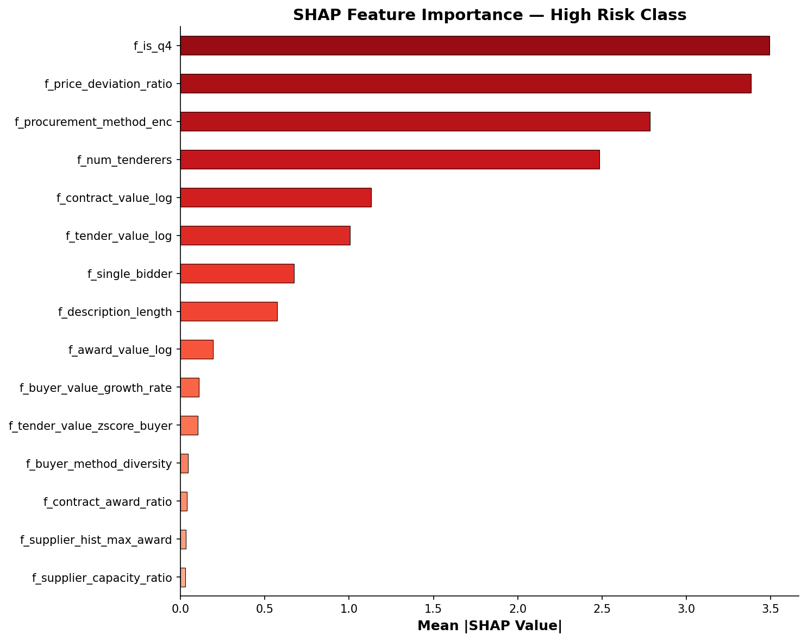
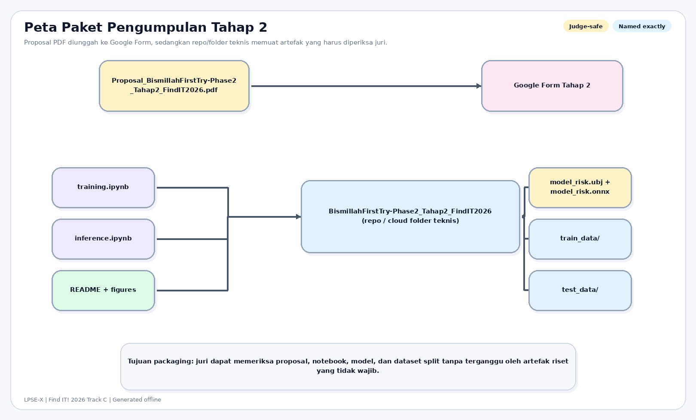

# BAB 3: KEPATUHAN DAN IMPLEMENTASI

## 3.1 Matriks Kepatuhan Track C

Bab ini ditulis khusus untuk memenuhi ketentuan panitia bahwa **Bab 3 harus menjelaskan secara rinci bagaimana solusi mematuhi setiap constraint track**. Tabel berikut menjadi ringkasan paling langsung untuk juri.

| Kode | Constraint resmi | Implementasi pada LPSE-X | Bukti utama |
| --- | --- | --- | --- |
| C-C1 | Explainability wajib | Prediksi dijelaskan dengan SHAP global dan lokal | `src/explain.py`, `figures/shap_summary.png` |
| C-C2 | Output penjelasan harus human-readable | Inference menghasilkan narasi Bahasa Indonesia dengan faktor utama dan arah pengaruh | `src/narrative.py`, `inference.ipynb` |
| C-C3 | Anti-black-box | Model utama adalah XGBoost tabular yang dapat diinspeksi; explainability bukan tempelan kosmetik | `src/model.py`, `models/xgb_model.ubj`, `models/xgb_model.onnx` |
| C-C4 | Wajib membuktikan tidak ada data leakage | Raw split dilakukan sebelum preprocessing; test tidak dipakai untuk tuning atau kalibrasi | `src/split.py`, `train_data/raw.parquet`, `test_data/raw.parquet`, `data/processed/split_metadata.json` |
| C-C5 | Offline total | Training, inferensi, dan explainability berjalan lokal tanpa API cloud | `training.ipynb`, `inference.ipynb`, `requirements.txt` |

Tabel di atas adalah checklist kepatuhan utama untuk juri: setiap constraint Track C dipetakan langsung ke artefak implementasi yang bisa diperiksa pada repo submission.

## 3.2 Pembuktian per Constraint

### C-C1 — Explainability wajib

LPSE-X memenuhi constraint explainability dengan menjadikan SHAP sebagai bagian inti pipeline, bukan sekadar lampiran presentasi. Model tidak hanya mengeluarkan probabilitas kelas, tetapi juga daftar faktor yang paling mendorong hasil prediksi. Ini memungkinkan reviewer mengetahui **mengapa** sebuah paket diprioritaskan.

### C-C2 — Output penjelasan yang dapat dibaca manusia

Track C menuntut penjelasan yang dapat dibaca manusia untuk setiap prediksi. Karena itu, LPSE-X menyediakan dua lapisan output pada jalur inference:

1. daftar minimal tiga faktor teratas,
2. arah pengaruh masing-masing faktor terhadap skor,
3. narasi Bahasa Indonesia yang menjelaskan hasil dalam bentuk kalimat operasional.

Dengan desain ini, reviewer tidak perlu menginterpretasi angka mentah sendiri. Outputnya sudah siap dipakai sebagai bahan prioritisasi atau diskusi awal.

### C-C3 — Anti-black-box

Kami sengaja tidak menggunakan arsitektur yang sepenuhnya opaque untuk submission Tahap 2. XGBoost dipilih karena lebih cocok untuk data tabular dan lebih mudah dipertanggungjawabkan pada konteks kebijakan publik. Bila juri menelusuri artefaknya, mereka dapat memeriksa:

- fitur input yang digunakan,
- manifest fitur dan split,
- model akhir yang diekspor,
- metrik evaluasi,
- visual explainability.

Dengan demikian, sistem tetap bisa diaudit dari input hingga output.

### C-C4 — Validasi data leakage

Ini adalah constraint paling kritis, dan LPSE-X memenuhinya secara eksplisit.

1. Folder `train_data/` dan `test_data/` dibentuk dari raw split terlebih dahulu.
2. Feature engineering dilakukan terpisah setelah raw split sudah final.
3. Hyperparameter optimization, thresholding, dan temperature scaling hanya memakai data di sisi train/dev.
4. Fitur historis tidak diizinkan melihat masa depan.

Ringkasan split yang dipakai pada repo saat ini adalah:

- train: **372.150** baris
- test: **93.034** baris
- split boundary: **2023-03-10 07:27:51 UTC**

Desain ini adalah inti kepatuhan C-C4 dan menjadi salah satu alasan utama solusi kami tetap defensible.

### C-C5 — Offline total

Seluruh komponen inti berjalan lokal:

- training model,
- inference,
- SHAP explanation,
- narasi Bahasa Indonesia,
- ekspor model `.ubj` dan `.onnx`.

LPSE-X **tidak** menggunakan API inferensi cloud, API explainability, maupun layanan generative AI eksternal di pipeline utama. Kepatuhan ini penting bukan hanya untuk aturan kompetisi, tetapi juga selaras dengan semangat digital sovereignty pada tema hackathon.

## 3.3 Kesiapan Paket Submission

Selain constraint Track C, panitia juga mensyaratkan struktur artefak yang jelas. Paket Tahap 2 untuk LPSE-X disusun agar juri mudah memeriksa ulang komponen utama berikut.

| Artefak submission | Status peran |
| --- | --- |
| `proposal-final.md` / PDF final | narasi proposal yang siap diekspor ke PDF |
| `training.ipynb` | jalur pelatihan dengan log yang terlihat |
| `inference.ipynb` | jalur inferensi yang lebih bersih dan demo-friendly |
| `train_data/` dan `test_data/` | bukti split fisik yang terpisah |
| file model final | model siap dipakai secara lokal |
| `requirements.txt` | reproduksibilitas environment |

Pendekatan ini sengaja dibuat judge-safe: yang ditampilkan adalah artefak yang benar-benar dibutuhkan untuk evaluasi, bukan seluruh histori eksperimen internal.

## 3.4 Pengendalian Risiko Teknis

Agar implementasi tetap stabil di bawah tekanan waktu kompetisi, beberapa prinsip pengendalian risiko dipertahankan.

1. **Fallback tetap tersedia** — bila jalur counterfactual yang lebih berat tidak stabil, sistem tetap bisa menjelaskan hasil melalui SHAP dan narasi deterministik.
2. **Model artefak ganda** — ekspor `.ubj` dan `.onnx` mengurangi risiko kegagalan demo pada satu format saja.
3. **Sumber kebenaran artefak** — bila ada perbedaan antara narasi proposal dan implementasi, artefak repo menjadi acuan utama.
4. **No overclaim policy** — output disebut sebagai risk screening, bukan putusan fraud.

## 3.5 Posisi Ilmiah yang Jujur

Kepatuhan teknis tidak boleh membuat proposal kehilangan kejujuran ilmiah. Karena itu, LPSE-X secara eksplisit menyatakan bahwa:

1. metrik utama masih dievaluasi terhadap **heuristic risk labels**,
2. audit robustness menunjukkan circularity risk yang signifikan,
3. evidence lane dan manual review menambah bukti yang berguna, tetapi belum mengubah sistem menjadi oracle hukum final.

Justru dengan menyatakan batasan ini secara terbuka, proposal menjadi lebih kuat di hadapan juri: solusi terlihat serius, patuh constraint, dan tidak menjual klaim berlebihan.

## 3.6 Bukti Verifikasi Implementasi

Status implementasi yang relevan untuk Tahap 2 dapat diringkas sebagai berikut.

- pipeline split-aware tersedia dan terdokumentasi;
- model akhir sudah tersimpan dan dapat diekspor untuk inferensi lokal;
- visual evaluasi utama sudah tersedia di `proposal/figures/`;
- notebook training dan inference sudah menjadi artefak submission;
- proposal kini memetakan setiap constraint Track C ke artefak nyata.

