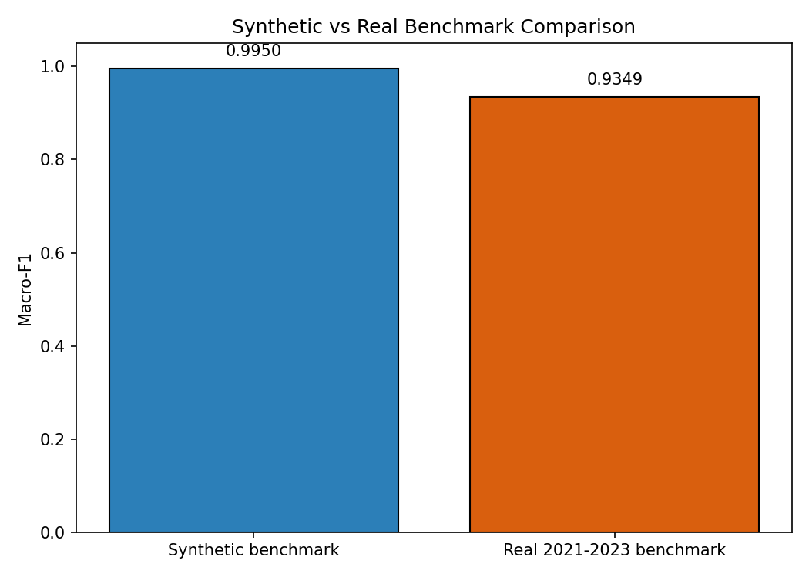
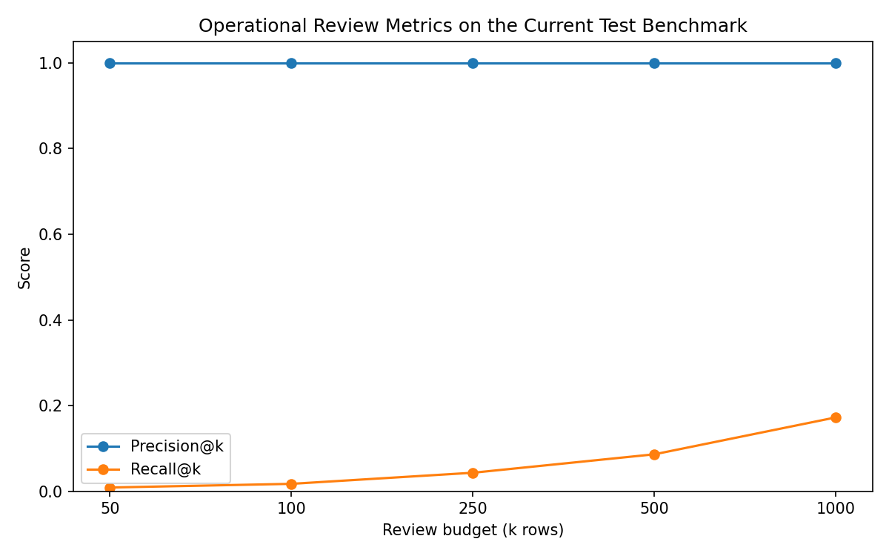
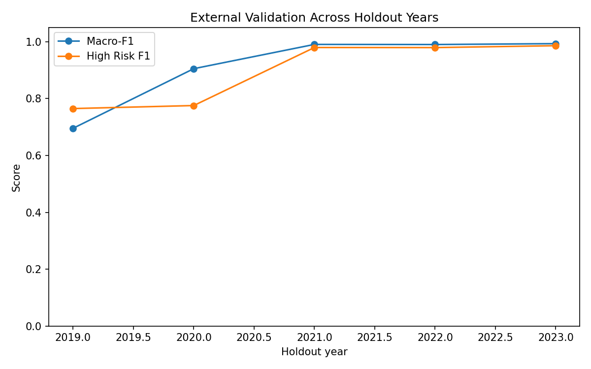
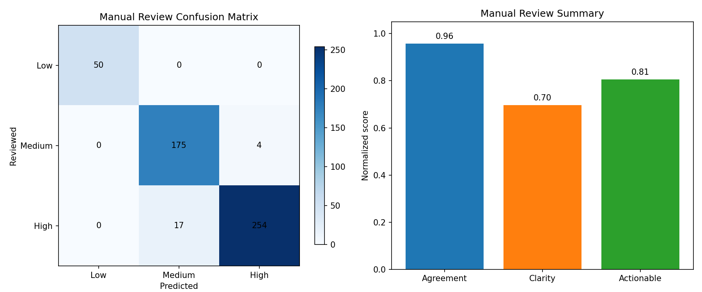
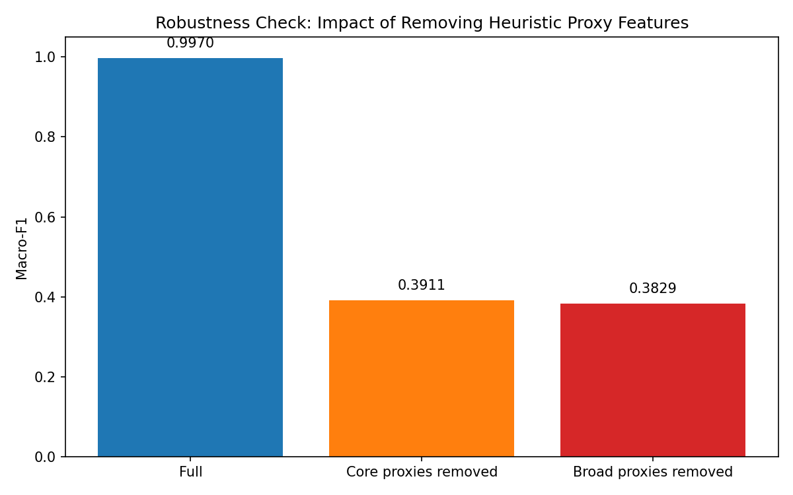

# Benchmark dan Interpretasi Hasil LPSE-X

## Ringkasan Tujuan

Dokumen ini menjelaskan secara ringkas tetapi eksplisit **benchmark** yang digunakan untuk mengevaluasi LPSE-X, mengapa benchmark tersebut layak dipakai pada Tahap 2, bagaimana hasil utama harus dibaca, dan apa batas ilmiah yang tetap harus dijaga. Bagian ini dapat dipakai sebagai lampiran, bahan presentasi, atau dasar penjelasan tambahan ketika juri meminta klarifikasi tentang kualitas model.

## 1. Benchmark yang Digunakan

LPSE-X saat ini dievaluasi pada **benchmark data riil multi-tahun OCDS Indonesia** yang telah diproses secara lokal di repo. Fokus benchmark ini bukan membuktikan korupsi secara hukum, melainkan menguji seberapa baik model:

1. mengurutkan paket yang mengandung sinyal risiko,
2. memisahkan prioritas audit secara leakage-safe,
3. memberikan penjelasan yang dapat dipakai reviewer.

Benchmark ini memakai:

- **465.184** baris usable,
- **372.150** baris train,
- **93.034** baris test,
- **618** buyer unik,
- **60.976** supplier unik.

Setiap baris mewakili satu paket/tender yang telah memiliki fitur terstruktur hasil pipeline lokal.

## 2. Mengapa Benchmark Ini Penting

Benchmark ini penting karena lebih kuat daripada pendekatan demonstratif berbasis sampel kecil atau data sintetis semata. Nilai utamanya ada pada tiga hal:

### A. Data riil

Data berasal dari artefak OCDS Indonesia yang benar-benar digunakan sebagai dasar eksperimen, bukan data simulasi buatan dari nol.

### B. Split anti-leakage

Pemisahan `train_data` dan `test_data` dilakukan **sebelum** rekayasa fitur. Dengan demikian, hasil evaluasi tidak tercemar oleh kebocoran informasi dari data uji ke data latih.

### C. Konteks operasional

Karena target penggunaan LPSE-X adalah triase audit, benchmark ini juga berguna untuk mengukur apakah model mampu menghasilkan shortlist prioritas yang padat sinyal risiko.

## 3. Label yang Dipakai dan Konsekuensi Ilmiahnya

Benchmark LPSE-X memakai **heuristic risk labels**, bukan ground-truth fraud outcome untuk seluruh populasi data. Ini berarti:

- skor tinggi menunjukkan model sangat baik dalam **mereplikasi dan mengurutkan sinyal risiko heuristik**,
- skor tinggi **tidak boleh** dibaca sebagai bukti bahwa model telah menyelesaikan deteksi fraud dunia nyata,
- hasil benchmark harus dibaca bersama audit robustness dan manual-review evidence.

Posisi yang benar adalah:

> LPSE-X adalah sistem **triase risiko pengadaan** yang leakage-safe, explainable, dan berguna untuk prioritisasi audit awal.

## 4. Hasil Utama pada Held-Out Test

Berdasarkan `models/metrics.json`, hasil utama pada held-out test saat ini adalah:

| Metrik | Nilai |
| --- | ---: |
| Accuracy | **0,9899** |
| Macro-F1 | **0,9830** |
| Weighted-F1 | **0,9898** |
| Log loss | **0,0553** |
| Test rows | **93.034** |

### F1 per kelas

| Kelas | F1 |
| --- | ---: |
| Low Risk | **0,9932** |
| Medium Risk | **0,9920** |
| High Risk | **0,9639** |

Interpretasi utamanya:

1. model sangat kuat terhadap benchmark heuristik yang digunakan,
2. area tersulit tetap berada pada batas **Medium Risk ↔ High Risk**,
3. hampir tidak ada indikasi flip ekstrem **Low Risk ↔ High Risk**.

Gambar ini membantu menjelaskan bahwa benchmark yang dipakai sekarang lebih kredibel daripada versi sintetis sebelumnya. Bagi juri, visual ini penting karena menunjukkan bahwa performa tinggi yang dilaporkan bukan berasal dari skenario mainan yang terlalu mudah.

## 5. Nilai Operasional dari Benchmark

Untuk auditor, pertanyaan yang lebih penting daripada “berapa akurasinya?” adalah:

> “Apakah model membantu saya fokus pada kasus yang paling layak diperiksa?”

Di sini LPSE-X menunjukkan kekuatan besar. Berdasarkan `models/operational_metrics.json`:

- Precision@50 = **1,00**
- Precision@100 = **1,00**
- Precision@250 = **1,00**
- Precision@500 = **1,00**
- Precision@1000 = **1,00**

Artinya, pada benchmark ini, antrean prioritas tertinggi sangat kaya sinyal risiko. Bagi workflow audit dengan kapasitas terbatas, ini adalah bukti bahwa LPSE-X berfungsi baik sebagai **mesin pemeringkatan prioritas review**.

Visual ini menekankan bahwa kekuatan model tidak hanya ada pada angka F1, tetapi juga pada kemampuan mengisi antrean review teratas dengan kasus yang lebih layak diperiksa.

## 6. Bukti Tambahan di Luar Satu Split Uji

Benchmark LPSE-X tidak berhenti pada satu tabel metrik.

### A. External validation lintas tahun

`models/external_validation.json` menunjukkan:

- mean Macro-F1 = **0,9151**
- min Macro-F1 = **0,6956**
- max Macro-F1 = **0,9934**
- mean High Risk F1 = **0,8972**

Maknanya:
- performa tetap cukup kuat di banyak fold waktu,
- generalisasi paling lemah muncul pada fold awal dengan histori yang lebih sempit.

### B. Manual review evidence

`models/manual_review_summary.json` dan artefak review lainnya menunjukkan:

- overall agreement = **95,8%**
- reviewed-subset Macro-F1 = **0,9679**
- reviewed High Risk F1 = **0,9603**

Maknanya:
- model tidak hanya cocok terhadap weak labels,
- tetapi juga cukup selaras dengan review manual pada subset yang diperiksa.

## 7. Keterbatasan Benchmark yang Harus Diakui

Justru karena proposal ini ingin kuat secara ilmiah, keterbatasan benchmark harus disebut dengan jelas.

### A. Circularity risk masih kuat

Artefak `models/robustness.json` menunjukkan bahwa ketika fitur-fitur yang paling dekat dengan aturan heuristik dihapus, Macro-F1 turun tajam dari sekitar **0,983** menjadi sekitar **0,505**. Ini berarti model masih sangat bergantung pada struktur sinyal yang dekat dengan label.

Visual ini justru penting untuk memperkuat kejujuran ilmiah proposal. Alih-alih menyembunyikan kelemahan, LPSE-X menunjukkan kepada juri bahwa model ini kuat untuk triase, tetapi masih memerlukan penguatan label dan validasi lapangan agar lebih kokoh sebagai sistem investigatif.

### B. Label belum setara outcome fraud final

Karena target yang dipakai masih heuristic labels, benchmark ini lebih akurat disebut sebagai:

> **benchmark triase risiko pengadaan**

daripada benchmark fraud detection final.

### C. Kualitas field sumber tidak merata

Beberapa field sumber masih memiliki coverage lemah, sehingga sebagian sinyal struktural belum sekuat yang diharapkan.

## 8. Kesimpulan yang Tepat untuk Juri

Kesimpulan benchmark LPSE-X harus dirumuskan secara tegas tetapi jujur:

1. benchmark saat ini **kuat, leakage-safe, dan berbasis data riil**,
2. model menunjukkan **kinerja sangat tinggi terhadap sinyal risiko heuristik**,
3. nilai praktis terbesar model ada pada **pemeringkatan shortlist audit**,
4. hasil ini **belum** boleh diterjemahkan sebagai bukti bahwa fraud detection pada dunia nyata telah selesai,
5. justru kekuatan LPSE-X ada pada kombinasi:
   - data riil,
   - split anti-leakage,
   - explainability,
   - bukti operasional,
   - dan kejujuran evaluasi.

Dengan kata lain, benchmark LPSE-X paling kuat ketika dibaca sebagai:

> **bukti bahwa sistem dapat membantu auditor memilih kasus yang lebih layak diperiksa, dengan cara yang transparan dan dapat dipertanggungjawabkan.**
