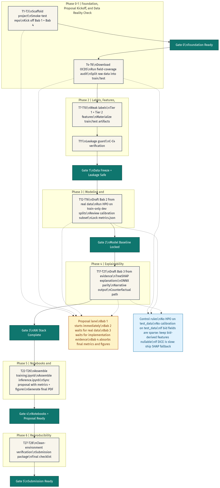
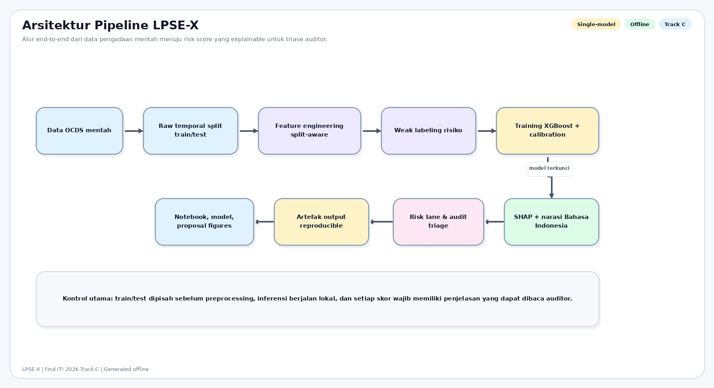
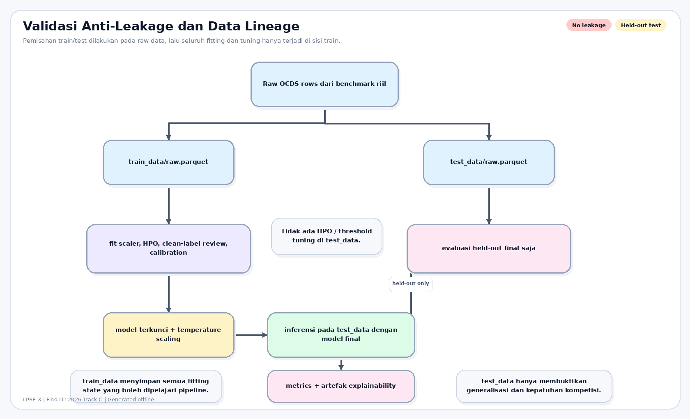
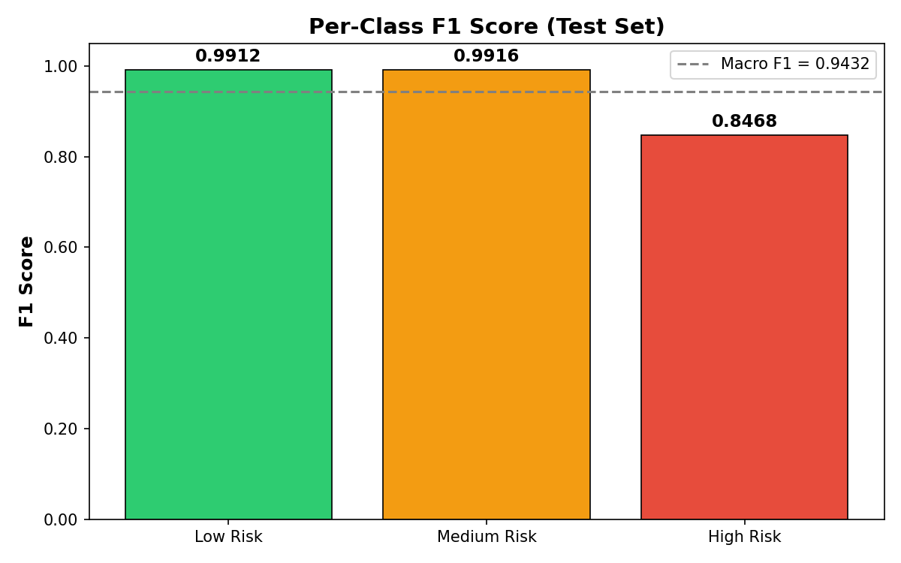
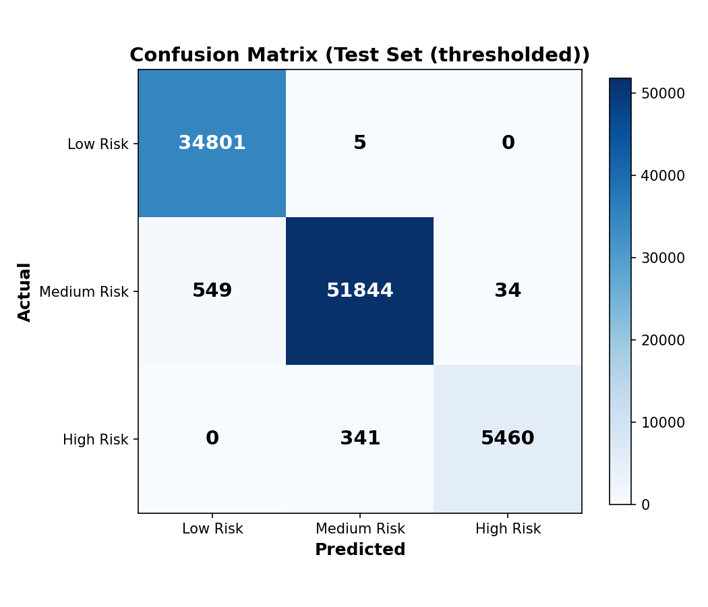
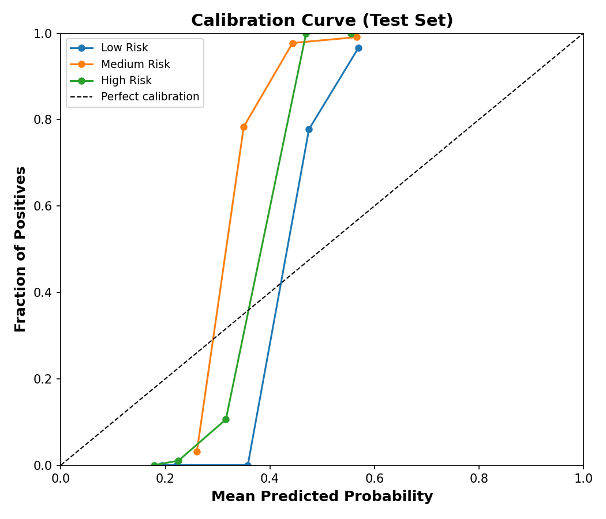
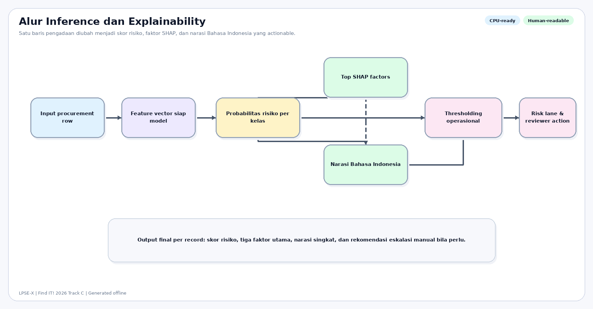
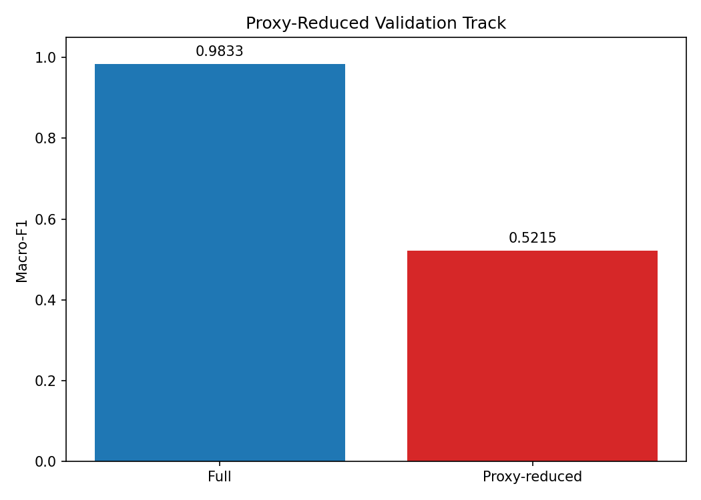
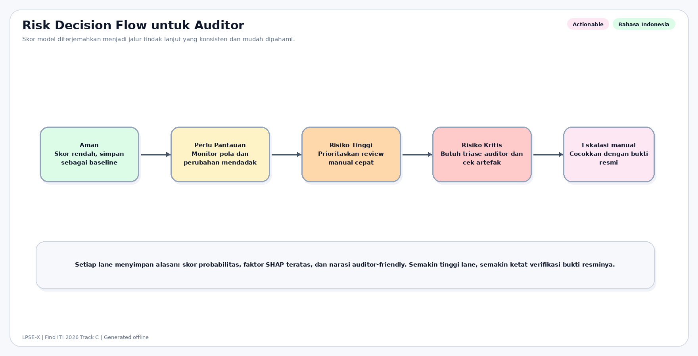

# Proposal LPSE-X — Find IT! 2026 Tahap 2

## Identitas Dokumen

- **Nama Tim:** BismillahFirstTry-Phase2
- **Nama Solusi:** LPSE-X
- **Track:** Track C — *The Explainable Oracle (Predictive Analytics)*
- **Subtema:** Smart Governance & Public Service
- **Posisi Solusi:** explainable procurement-risk screening system untuk membantu prioritisasi audit pengadaan publik

## Ringkasan Eksekutif

LPSE-X adalah sistem prediktif offline untuk membantu menyaring paket pengadaan yang layak diperiksa lebih dulu. Sistem ini dibangun dengan model XGBoost tabular, dilengkapi SHAP untuk explainability, dan menghasilkan penjelasan Bahasa Indonesia agar hasil prediksi dapat dibaca manusia. Seluruh pipeline dirancang patuh terhadap constraint Track C: explainability wajib, human-readable explanation, anti-black-box, validasi anti-leakage, dan offline total.

Secara ilmiah, proposal ini mengambil posisi yang konservatif dan defensible. Metrik utama memang tinggi pada benchmark saat ini, tetapi tetap dilaporkan sebagai performa terhadap **heuristic risk labels**, bukan sebagai bukti final keberhasilan mendeteksi kasus korupsi yang sudah terverifikasi untuk seluruh dataset. Karena itu, kekuatan utama LPSE-X pada Tahap 2 adalah kombinasi antara **kepatuhan teknis, kualitas presentasi, dan kejujuran evaluasi**.

## Daftar Isi

1. Bab 1 — Pendahuluan
2. Bab 2 — Metodologi
3. Bab 3 — Kepatuhan dan Implementasi
4. Bab 4 — Hasil dan Pembahasan

---

# BAB 1: PENDAHULUAN

## 1.1 Latar Belakang

Pengadaan barang dan jasa pemerintah adalah domain dengan nilai transaksi besar, kompleksitas proses tinggi, dan konsekuensi publik yang langsung terasa. Pada praktiknya, auditor dan pengawas tidak kekurangan data; yang kurang adalah **alat triase yang mampu menyaring ribuan paket secara konsisten, cepat, dan dapat dijelaskan**. Tanpa alat bantu yang explainable, pengawasan cenderung kembali pada pemeriksaan manual yang mahal, lambat, dan sulit diprioritaskan.

LPSE-X dikembangkan untuk menjawab kebutuhan tersebut pada subtema **Smart Governance & Public Service**. Fokus kami bukan membangun mesin keputusan hukum, melainkan **sistem penyaringan risiko pengadaan** yang dapat membantu auditor menentukan paket mana yang layak ditelaah lebih dulu. Posisi ini penting karena pada konteks publik, akurasi yang tinggi saja belum cukup; alasan di balik skor juga harus dapat dipahami dan dipertanggungjawabkan.

Secara teknis, Track C menuntut dua hal sekaligus: model prediktif yang presisi **dan** transparan. Karena itu, solusi kami dirancang dari awal sebagai pipeline offline berbasis data terstruktur, dengan pemisahan train/test sebelum preprocessing, model tabular yang dapat diinspeksi, serta lapisan explainability yang menghasilkan narasi Bahasa Indonesia untuk setiap prediksi.

## 1.2 Rumusan Masalah

Rumusan masalah yang dijawab proposal ini adalah sebagai berikut.

1. Bagaimana mengubah data pengadaan publik berbasis OCDS menjadi pipeline analitik yang siap dipakai untuk triase risiko?
2. Bagaimana membangun model prediktif yang tetap patuh pada prinsip **anti-data-leakage** dan dapat dijalankan sepenuhnya secara offline?
3. Bagaimana menghasilkan penjelasan prediksi yang tidak berhenti pada probabilitas, tetapi dapat dibaca manusia dan berguna bagi reviewer non-teknis?
4. Bagaimana menyajikan hasil model secara jujur, termasuk keterbatasan weak labels dan circularity risk, agar solusi tetap ilmiah dan defensible di depan juri?

## 1.3 Posisi Solusi dan Nilai Utama

LPSE-X diposisikan sebagai **explainable procurement-risk screening system** dengan empat nilai utama.

1. **Praktis untuk triase** — sistem memprioritaskan paket yang layak ditinjau lebih dulu, bukan menggantikan investigator.
2. **Patuh Track C** — setiap prediksi disertai alasan, arah pengaruh, dan bukti bahwa pipeline tidak melanggar aturan anti-leakage serta offline total.
3. **Siap didemokan** — model diekspor ke artefak ringan (`.ubj` dan `.onnx`) dan dilengkapi notebook training serta inference.
4. **Jujur secara ilmiah** — metrik dilaporkan terhadap label heuristik risiko, bukan diklaim sebagai tingkat keberhasilan mendeteksi korupsi yang sudah terverifikasi.

> **Catatan visual untuk PDF final:** letakkan diagram arsitektur end-to-end LPSE-X pada akhir subbab ini untuk membantu juri memahami alur data → model → explanation → reviewer action.

## 1.4 Tujuan

Tujuan pengembangan LPSE-X pada Tahap 2 adalah:

1. menyusun pipeline data pengadaan yang rapi, split-aware, dan reproducible;
2. melatih model prediktif berbasis XGBoost untuk klasifikasi risiko pengadaan;
3. menghasilkan output explainability yang memenuhi kebutuhan Track C, termasuk minimal tiga faktor teratas beserta arah pengaruhnya;
4. menyiapkan paket submission yang mudah diperiksa juri: proposal, notebook, model, dan folder data terpisah;
5. menunjukkan posisi ilmiah proyek secara seimbang: cukup kuat untuk demo, tetapi tetap eksplisit mengenai keterbatasannya.

## 1.5 Batasan dan Kejujuran Ilmiah

Agar tidak terjadi overclaim, proposal ini menetapkan batasan berikut.

1. Data kerja berasal dari artefak OCDS yang telah diproses lokal di repo ini; benchmark saat ini adalah **slice data riil** dengan total 465.184 baris usable, bukan seluruh histori pengadaan nasional.
2. Label target adalah **heuristic risk labels**, bukan putusan hukum atau ground truth fraud outcome untuk seluruh dataset.
3. Model digunakan untuk **risk screening**, sehingga outputnya harus dipahami sebagai prioritas review, bukan keputusan final atau tuduhan pelanggaran.
4. Explainability yang dipakai adalah SHAP dan narasi deterministik, bukan generative AI atau cloud explanation service.
5. Hasil evaluasi yang sangat tinggi tetap harus dibaca bersama audit circularity agar tidak disalahartikan sebagai bukti final validitas lapangan.

## 1.6 Manfaat

### Bagi juri dan pengguna akhir

- Memberi contoh solusi AI yang relevan langsung dengan tata kelola publik.
- Menunjukkan bagaimana model prediktif dapat tetap transparan dan audit-friendly.
- Menawarkan alur kerja yang realistis: model membantu memprioritaskan review, lalu reviewer manusia mengambil keputusan.

### Bagi auditor atau pengawas

- Menyediakan daftar prioritas paket dengan alasan utama di balik skor.
- Mengurangi beban pemeriksaan awal pada kumpulan data yang besar.
- Membuka jalan menuju casebook investigatif yang lebih mudah dikomunikasikan.

### Bagi pengembangan riset lanjut

- Menyediakan baseline pipeline yang reproducible untuk eksperimen data, label review, dan validasi yang lebih kuat di masa depan.
- Menunjukkan secara terbuka area yang masih lemah, terutama circularity risk dan keterbatasan weak labels.

## 1.7 Sistematika Penulisan

- **Bab 1 — Pendahuluan**: konteks masalah, posisi solusi, tujuan, manfaat, dan batasan ilmiah.
- **Bab 2 — Metodologi**: sumber data, split anti-leakage, fitur, model, explainability, dan artefak reproduksibilitas.
- **Bab 3 — Kepatuhan dan Implementasi**: pembuktian langsung terhadap setiap constraint Track C dan kesiapan paket submission.
- **Bab 4 — Hasil dan Pembahasan**: metrik, visual evaluasi, interpretasi operasional, evidence lane, serta keterbatasan sistem.

---

# BAB 2: METODOLOGI

## 2.1 Gambaran Umum Pipeline

LPSE-X dibangun sebagai pipeline offline untuk mengubah data pengadaan publik menjadi **skor risiko yang dapat dijelaskan**. Alur kerjanya terdiri atas enam tahap inti:

1. ingest dan pembersihan data OCDS;
2. pemisahan `train_data` dan `test_data` pada level raw data;
3. rekayasa fitur yang split-aware;
4. pembentukan heuristic risk labels;
5. pelatihan model XGBoost dan kalibrasi probabilitas;
6. generasi explanation berbasis SHAP dan narasi Bahasa Indonesia.

Diagram implementasi Phase 2 yang sudah tersedia di repo memberi gambaran urutan pembangunan sistem.

Untuk kebutuhan juri, alur inti end-to-end diringkas lagi pada diagram berikut agar hubungan antara data, model, dan keluaran explainability dapat dibaca lebih cepat.

## 2.2 Sumber Data dan Kualitas

Pipeline bekerja di atas artefak lokal yang dibangun dari publikasi data OCDS Indonesia. Provenance utamanya tersimpan pada `data/processed/data_provenance.json`, sedangkan metadata split ada di `data/processed/split_metadata.json`.

Ringkasan benchmark saat ini:

- total baris usable: **465.184**
- buyer unik: **618**
- supplier unik: **60.976**
- train rows: **372.150**
- test rows: **93.034**
- rentang train: **2015-07-09 s.d. 2023-03-10 07:27:51 UTC**
- rentang test: **2023-03-10 07:38:45 s.d. 2023-12-20 23:00:00 UTC**

Temuan kualitas data yang paling penting untuk dibaca juri adalah sebagai berikut.

1. `award_value_amount` relatif kuat sehingga tetap berguna untuk sinyal nilai.
2. Beberapa field seperti `tender.value.amount` dan `tender.description` memerlukan fallback karena coverage tidak konsisten.
3. Coverage `tender_numberOfTenderers`, `contracts`, dan `procurementMethod` masih lemah pada slice ini.
4. Karena kualitas field tidak merata, proposal ini lebih jujur bila memposisikan sistem sebagai **prototype risk screening** daripada solusi operasional nasional yang matang.

## 2.3 Strategi Split Data dan Anti-Leakage

Constraint terpenting pada Track C adalah bukti bahwa **tidak ada data leakage** antara train dan test. Karena itu, LPSE-X menerapkan aturan berikut.

1. `src/split.py` memisahkan raw data terlebih dahulu menjadi `train_data/raw.parquet` dan `test_data/raw.parquet`.
2. Feature engineering dilakukan **setelah** pemisahan tersebut, bukan sebelumnya.
3. Di dalam train split, data masih dipecah lagi menjadi `train_fit`, `val_hpo`, dan `val_calibration` untuk menjaga disiplin eksperimen.
4. `test_data/` tidak dipakai untuk hyperparameter optimization, threshold tuning, ataupun temperature scaling.
5. Fitur historis dibangun dengan prinsip expanding-window, sehingga hanya memakai histori masa lalu.

Konsekuensi desain ini adalah setiap angka evaluasi di Bab 4 berasal dari pemisahan yang defensible terhadap kebocoran data.

## 2.4 Pelabelan Risiko dan Implikasi Ilmiahnya

Karena tidak tersedia label fraud terverifikasi untuk seluruh populasi data, LPSE-X menggunakan **heuristic risk labeling** dengan tiga kelas:

- **Low Risk**
- **Medium Risk**
- **High Risk**

Distribusi label pada artefak saat ini adalah:

| Split | Low | Medium | High |
| --- | ---: | ---: | ---: |
| Train | 124.351 | 223.427 | 24.372 |
| Test | 26.358 | 58.425 | 8.251 |

Label ini dibentuk dari kombinasi red flag yang relevan untuk pengadaan, misalnya sinyal peserta tunggal, deviasi harga, timing pengadaan, dan pola hubungan buyer–supplier. Secara metodologis, ini berarti model belajar **mendekati struktur sinyal risiko** yang didefinisikan oleh aturan tersebut. Karena itu, performa tinggi wajib dibaca bersama audit circularity; model ini tidak boleh diklaim sebagai estimator sempurna atas fraud yang telah dibuktikan secara hukum.

## 2.5 Rekayasa Fitur

Manifest fitur pada `data/processed/feature_manifest.json` menunjukkan bahwa model akhir memakai **34 fitur**. Fitur-fitur ini dibagi ke dalam dua lapisan besar.

### Tier 1 — Fitur langsung dari paket pengadaan

Contoh sinyal yang digunakan:

- nilai tender dan nilai award (dengan fallback yang terdokumentasi),
- deviasi harga,
- durasi dan timing tender,
- panjang judul/deskripsi,
- jumlah item,
- indikator musiman seperti Q4 dan Desember.

### Tier 2 — Fitur historis dan relasional

Contoh sinyal yang digunakan:

- rata-rata historis nilai buyer,
- frekuensi kemenangan supplier,
- pengulangan pasangan buyer–supplier,
- z-score nilai tender relatif terhadap histori buyer,
- intensitas aktivitas buyer atau supplier pada jendela waktu tertentu.

Seluruh artefak fiturnya dimaterialisasi ke `train_data/features.parquet` dan `test_data/features.parquet` agar proses training maupun audit dapat diulang tanpa langkah tersembunyi.

## 2.6 Pemodelan dan Alasan Pemilihan Model

Model utama yang dipakai adalah **XGBoost multiclass** dengan objective `multi:softprob`. Pemilihan ini disengaja karena XGBoost memenuhi kebutuhan Track C secara lebih natural dibanding model yang lebih opaque:

1. cocok untuk data tabular terstruktur,
2. efisien pada CPU-only,
3. mudah dihubungkan ke SHAP untuk explainability global maupun lokal,
4. bisa diekspor ke artefak ringan untuk demo lokal.

Artefak model yang saat ini tersedia juga kecil dan praktis untuk submission:

- `models/xgb_model.ubj` ≈ **1,1 MB**
- `models/xgb_model.onnx` ≈ **423 KB**

Ukuran ini mendukung narasi bahwa solusi dapat dibawa dan dijalankan secara offline tanpa kebutuhan infrastruktur berat.

## 2.7 Kalibrasi Probabilitas dan Explainability

LPSE-X tidak berhenti pada skor mentah. Pipeline juga melapisi model dengan:

1. **temperature scaling** untuk melunakkan probabilitas,
2. **SHAP** untuk faktor pendorong prediksi,
3. **narasi Bahasa Indonesia** agar output bisa dibaca auditor.

Parameter kalibrasi saat ini tersimpan di `models/calibration.json` dengan ringkasan:

- temperature: **7,697482**
- calibration samples: **287**
- method: **temperature scaling**

Pada level output, fungsi `explain_single(...)` dirancang untuk memenuhi kebutuhan Track C: setiap prediksi dapat diterjemahkan menjadi minimal tiga faktor teratas, lengkap dengan arah pengaruhnya, lalu dirender ke penjelasan Bahasa Indonesia yang bisa dipakai dalam notebook inference maupun casebook demo.

## 2.8 Artefak Submission dan Reproducibility

Struktur submission yang disiapkan untuk juri mengikuti constraint umum kompetisi.

| Artefak | Peran |
| --- | --- |
| `training.ipynb` | menunjukkan pelatihan model dan log yang terlihat |
| `inference.ipynb` | menunjukkan alur inferensi yang bersih dan siap demo |
| `train_data/` | artefak data latih hasil split raw |
| `test_data/` | artefak data uji yang terpisah |
| `models/xgb_model.ubj` / `models/xgb_model.onnx` | model final untuk deployment lokal |
| `requirements.txt` | dependency agar eksperimen dapat dijalankan ulang |
| `proposal/figures/` | visual evaluasi dan bukti presentasi |

Dengan desain ini, juri tidak perlu menebak alur kerja proyek: semua komponen utama tersedia sebagai artefak lokal yang eksplisit.

## 2.9 Filosofi Evaluasi

Agar hasil mudah dibaca secara profesional, evaluasi pada proposal ini dibagi menjadi empat lapis:

1. **headline benchmark** pada test split heuristik,
2. **calibration dan confusion analysis** untuk membaca trade-off operasional,
3. **robustness / proxy-reduced validation** untuk mengukur circularity risk,
4. **manual review, external validation, dan official evidence lane** untuk memperkaya bukti di luar sekadar angka terhadap weak labels.

Dengan demikian, Bab 4 tidak hanya menampilkan performa yang tinggi, tetapi juga memberikan konteks mengapa performa tersebut perlu dibaca dengan hati-hati.

---

# BAB 3: KEPATUHAN DAN IMPLEMENTASI

## 3.1 Matriks Kepatuhan Track C

Bab ini ditulis khusus untuk memenuhi ketentuan panitia bahwa **Bab 3 harus menjelaskan secara rinci bagaimana solusi mematuhi setiap constraint track**. Tabel berikut menjadi ringkasan paling langsung untuk juri.

| Kode | Constraint resmi | Implementasi pada LPSE-X | Bukti utama |
| --- | --- | --- | --- |
| C-C1 | Explainability wajib | Prediksi dijelaskan dengan SHAP global dan lokal | `src/explain.py`, `figures/shap_summary.png` |
| C-C2 | Output penjelasan harus human-readable | Inference menghasilkan narasi Bahasa Indonesia dengan faktor utama dan arah pengaruh | `src/narrative.py`, `inference.ipynb` |
| C-C3 | Anti-black-box | Model utama adalah XGBoost tabular yang dapat diinspeksi; explainability bukan tempelan kosmetik | `src/model.py`, `models/xgb_model.ubj`, `models/xgb_model.onnx` |
| C-C4 | Wajib membuktikan tidak ada data leakage | Raw split dilakukan sebelum preprocessing; test tidak dipakai untuk tuning atau kalibrasi | `src/split.py`, `train_data/raw.parquet`, `test_data/raw.parquet`, `data/processed/split_metadata.json` |
| C-C5 | Offline total | Training, inferensi, dan explainability berjalan lokal tanpa API cloud | `training.ipynb`, `inference.ipynb`, `requirements.txt` |

Tabel di atas adalah checklist kepatuhan utama untuk juri: setiap constraint Track C dipetakan langsung ke artefak implementasi yang bisa diperiksa pada repo submission.

## 3.2 Pembuktian per Constraint

### C-C1 — Explainability wajib

LPSE-X memenuhi constraint explainability dengan menjadikan SHAP sebagai bagian inti pipeline, bukan sekadar lampiran presentasi. Model tidak hanya mengeluarkan probabilitas kelas, tetapi juga daftar faktor yang paling mendorong hasil prediksi. Ini memungkinkan reviewer mengetahui **mengapa** sebuah paket diprioritaskan.

### C-C2 — Output penjelasan yang dapat dibaca manusia

Track C menuntut penjelasan yang dapat dibaca manusia untuk setiap prediksi. Karena itu, LPSE-X menyediakan dua lapisan output pada jalur inference:

1. daftar minimal tiga faktor teratas,
2. arah pengaruh masing-masing faktor terhadap skor,
3. narasi Bahasa Indonesia yang menjelaskan hasil dalam bentuk kalimat operasional.

Dengan desain ini, reviewer tidak perlu menginterpretasi angka mentah sendiri. Outputnya sudah siap dipakai sebagai bahan prioritisasi atau diskusi awal.

### C-C3 — Anti-black-box

Kami sengaja tidak menggunakan arsitektur yang sepenuhnya opaque untuk submission Tahap 2. XGBoost dipilih karena lebih cocok untuk data tabular dan lebih mudah dipertanggungjawabkan pada konteks kebijakan publik. Bila juri menelusuri artefaknya, mereka dapat memeriksa:

- fitur input yang digunakan,
- manifest fitur dan split,
- model akhir yang diekspor,
- metrik evaluasi,
- visual explainability.

Dengan demikian, sistem tetap bisa diaudit dari input hingga output.

### C-C4 — Validasi data leakage

Ini adalah constraint paling kritis, dan LPSE-X memenuhinya secara eksplisit.

1. Folder `train_data/` dan `test_data/` dibentuk dari raw split terlebih dahulu.
2. Feature engineering dilakukan terpisah setelah raw split sudah final.
3. Hyperparameter optimization, thresholding, dan temperature scaling hanya memakai data di sisi train/dev.
4. Fitur historis tidak diizinkan melihat masa depan.

Ringkasan split yang dipakai pada repo saat ini adalah:

- train: **372.150** baris
- test: **93.034** baris
- split boundary: **2023-03-10 07:27:51 UTC**

Desain ini adalah inti kepatuhan C-C4 dan menjadi salah satu alasan utama solusi kami tetap defensible.

### C-C5 — Offline total

Seluruh komponen inti berjalan lokal:

- training model,
- inference,
- SHAP explanation,
- narasi Bahasa Indonesia,
- ekspor model `.ubj` dan `.onnx`.

LPSE-X **tidak** menggunakan API inferensi cloud, API explainability, maupun layanan generative AI eksternal di pipeline utama. Kepatuhan ini penting bukan hanya untuk aturan kompetisi, tetapi juga selaras dengan semangat digital sovereignty pada tema hackathon.

## 3.3 Kesiapan Paket Submission

Selain constraint Track C, panitia juga mensyaratkan struktur artefak yang jelas. Paket Tahap 2 untuk LPSE-X disusun agar juri mudah memeriksa ulang komponen utama berikut.

| Artefak submission | Status peran |
| --- | --- |
| `proposal-final.md` / PDF final | narasi proposal yang siap diekspor ke PDF |
| `training.ipynb` | jalur pelatihan dengan log yang terlihat |
| `inference.ipynb` | jalur inferensi yang lebih bersih dan demo-friendly |
| `train_data/` dan `test_data/` | bukti split fisik yang terpisah |
| file model final | model siap dipakai secara lokal |
| `requirements.txt` | reproduksibilitas environment |

Pendekatan ini sengaja dibuat judge-safe: yang ditampilkan adalah artefak yang benar-benar dibutuhkan untuk evaluasi, bukan seluruh histori eksperimen internal.

## 3.4 Pengendalian Risiko Teknis

Agar implementasi tetap stabil di bawah tekanan waktu kompetisi, beberapa prinsip pengendalian risiko dipertahankan.

1. **Fallback tetap tersedia** — bila jalur counterfactual yang lebih berat tidak stabil, sistem tetap bisa menjelaskan hasil melalui SHAP dan narasi deterministik.
2. **Model artefak ganda** — ekspor `.ubj` dan `.onnx` mengurangi risiko kegagalan demo pada satu format saja.
3. **Sumber kebenaran artefak** — bila ada perbedaan antara narasi proposal dan implementasi, artefak repo menjadi acuan utama.
4. **No overclaim policy** — output disebut sebagai risk screening, bukan putusan fraud.

## 3.5 Posisi Ilmiah yang Jujur

Kepatuhan teknis tidak boleh membuat proposal kehilangan kejujuran ilmiah. Karena itu, LPSE-X secara eksplisit menyatakan bahwa:

1. metrik utama masih dievaluasi terhadap **heuristic risk labels**,
2. audit robustness menunjukkan circularity risk yang signifikan,
3. evidence lane dan manual review menambah bukti yang berguna, tetapi belum mengubah sistem menjadi oracle hukum final.

Justru dengan menyatakan batasan ini secara terbuka, proposal menjadi lebih kuat di hadapan juri: solusi terlihat serius, patuh constraint, dan tidak menjual klaim berlebihan.

## 3.6 Bukti Verifikasi Implementasi

Status implementasi yang relevan untuk Tahap 2 dapat diringkas sebagai berikut.

- pipeline split-aware tersedia dan terdokumentasi;
- model akhir sudah tersimpan dan dapat diekspor untuk inferensi lokal;
- visual evaluasi utama sudah tersedia di `proposal/figures/`;
- notebook training dan inference sudah menjadi artefak submission;
- proposal kini memetakan setiap constraint Track C ke artefak nyata.

---

# BAB 4: HASIL DAN PEMBAHASAN

## 4.1 Ringkasan Hasil Utama

Pada benchmark heuristik yang saat ini dipakai di repo, LPSE-X mencapai performa berikut pada `models/metrics.json`:

| Metrik | Nilai |
| --- | ---: |
| Accuracy | **0,9899** |
| Macro-F1 | **0,9830** |
| Weighted-F1 | **0,9898** |
| Log loss | **0,0553** |
| Test rows | **93.034** |

Untuk juri, angka ini berarti model memiliki kemampuan ranking dan klasifikasi yang sangat kuat **terhadap label risiko heuristik yang digunakan pada benchmark saat ini**. Interpretasi ini penting: hasil tinggi tidak otomatis berarti sistem siap menggeneralisasi ke seluruh kasus nyata di lapangan.

## 4.2 Analisis per Kelas dan Confusion Matrix

F1 per kelas pada test split adalah sebagai berikut:

| Kelas | F1 |
| --- | ---: |
| Low Risk | **0,9932** |
| Medium Risk | **0,9920** |
| High Risk | **0,9639** |

Confusion matrix menunjukkan bahwa kesalahan terbesar tetap terkonsentrasi pada batas **Medium Risk ↔ High Risk**, bukan pada lompatan ekstrem Low ↔ High.

- Low Risk benar: **26.354 / 26.358**
- Medium Risk benar: **58.015 / 58.425**
- High Risk benar: **7.726 / 8.251**

Secara operasional, pola ini cukup masuk akal: batas ketidakpastian terbesar memang terjadi pada kasus yang sama-sama menampilkan sinyal risiko, tetapi belum cukup kuat untuk diposisikan pada kelas tertinggi.

## 4.3 Kalibrasi Probabilitas

LPSE-X tidak hanya mengejar klasifikasi yang tepat, tetapi juga probabilitas yang lebih dapat dipercaya. Temperature scaling dijalankan dengan **287 calibration samples** dan menghasilkan temperatur **7,697482**. Ini menunjukkan bahwa probabilitas mentah perlu dilunakkan sebelum dipakai sebagai dasar prioritas review.

Bagi juri, poin utamanya adalah: sistem tidak berhenti pada label kelas, tetapi juga memperhatikan kualitas skor probabilitas yang akan dipakai dalam workflow nyata.

## 4.4 Explainability dan Human-Readable Output

Track C menuntut penjelasan yang bisa dibaca manusia. Pada LPSE-X, SHAP digunakan untuk menunjukkan faktor global dan lokal, lalu hasilnya diterjemahkan menjadi narasi Bahasa Indonesia. Faktor yang sering muncul pada explanation review antara lain:

- `f_buyer_supplier_repeat_count`,
- `f_is_q4`,
- `f_title_length`,
- `f_supplier_recent_90d_award_count`,
- `f_tender_value_log`.

Pada evaluasi review manual, kualitas explanation menunjukkan:

- agreement explanation: **95,8%**
- clarity mean: **3,48 / 5**
- actionability mean: **4,03 / 5**

Artinya, explanation yang dihasilkan belum sempurna dari sisi kejelasan, tetapi sudah cukup membantu untuk actionability review.

Contoh *single-case explanation card* yang judge-friendly dapat diringkas sebagai berikut.

| Komponen | Ringkasan contoh |
| --- | --- |
| Paket | **Pengadaan Public Safety Diving Equipment** |
| Prediksi model | **High Risk (86,63%)** |
| Rating akhir | **Risiko Kritis** karena terhubung ke bukti resmi `kpk_procurement_case` |
| Tiga faktor utama | `f_tender_value_log` (+3,4595), `f_buyer_supplier_repeat_count` (+3,2338), `f_is_q4` (+3,2271) |
| Narasi singkat | Paket diprioritaskan karena sinyal nilai pengadaan tinggi, hubungan buyer–supplier yang berulang, dan timing kuartal IV sama-sama mendorong skor ke kelas risiko tertinggi. |
| Tindak lanjut | Reviewer memeriksa kecocokan entitas, kronologi kasus, dan dokumen pengadaan pendukung sebelum eskalasi investigatif final. |

## 4.5 Manual Review dan Validasi Tambahan

Review manual 500 baris menambah lapisan bukti penting di luar metrik terhadap weak labels. Artefak `models/reviewed_subset_metrics.json` menunjukkan:

- reviewed rows: **500**
- overall agreement: **95,8%**
- reviewed-subset Macro-F1: **0,9679**
- reviewed High Risk F1: **0,9603**

Temuan utamanya adalah disagreement terkonsentrasi pada area **Medium Risk ↔ High Risk**, sedangkan flip ekstrem **Low Risk ↔ High Risk** tidak muncul. Ini memperkuat posisi bahwa model cukup stabil sebagai alat triase, meskipun belum dapat disebut penyelesai akhir.

## 4.6 Robustness, Circularity Risk, dan Kejujuran Ilmiah

Bagian ini adalah alasan mengapa proposal kami tetap ilmiah dan tidak overclaim. Saat fitur-fitur yang paling dekat dengan aturan labeling dihapus, performa turun tajam:

| Track evaluasi | Macro-F1 |
| --- | ---: |
| Full model | **0,9831** |
| Proxy-core-removed | **0,5047** |
| Penurunan | **0,4784** |

Interpretasinya jelas: model saat ini sangat efektif sebagai **interpreter dan accelerator untuk risk rules yang ada**, tetapi masih menyimpan circularity gap yang besar. Inilah sebabnya LPSE-X diposisikan sebagai *explainable procurement-risk screening*, bukan penentu akhir atas outcome hukum atau investigatif.

## 4.7 Validasi Eksternal Lintas Waktu

LPSE-X juga diuji dengan skema holdout-year pada 2019–2023. Ringkasan `models/external_validation.json` menunjukkan:

- mean Macro-F1: **0,9151**
- min Macro-F1: **0,6956**
- max Macro-F1: **0,9934**
- mean High Risk F1: **0,8972**

Pesan penting untuk juri: generalisasi pada tahun-tahun terbaru terlihat kuat, tetapi fold awal seperti 2019 jauh lebih berat. Ini membuat klaim performa menjadi lebih seimbang dan realistis.

## 4.8 Metrik Operasional untuk Budget Review Terbatas

Dari sudut pandang pengguna nyata, auditor sering hanya punya kapasitas untuk meninjau sebagian kecil paket. Pada `models/operational_metrics.json`, LPSE-X menunjukkan bahwa daftar teratas sangat kaya sinyal High Risk:

- Precision@50 = **1,00**
- Precision@100 = **1,00**
- Precision@250 = **1,00**
- Precision@500 = **1,00**
- Precision@1000 = **1,00**

Interpretasi yang benar adalah: pada benchmark saat ini, model sangat baik dalam mengurutkan paket yang dianggap berisiko tinggi oleh sistem label yang digunakan. Sekali lagi, ini adalah kekuatan besar untuk workflow triase, tetapi tetap perlu dibaca bersama batasan label heuristik.

## 4.9 Evidence Lane dan Casebook Demo

Salah satu penguatan terbaru pada proyek ini adalah **evidence-backed risk lane** yang terpisah dari model heuristik. Artefak `data/processed/evidence/evidence_match_summary.json` menunjukkan:

- total evidence rows: **5**
- matched rows: **4**
- needs review rows: **1**

Sementara artefak `proposal/official_evidence_showcase.md` menunjukkan:

- official evidence-linked cases: **3**
- supporting official evidence rows: **4**
- cases with multi-source corroboration: **1**
- model predicted High Risk: **2**
- model predicted Medium Risk: **1**
- cases escalated to **Risiko Kritis** after evidence linkage: **3**

Bagi juri, ini menambah kualitas demo secara signifikan. Sistem tidak lagi hanya menampilkan angka model, tetapi juga menunjukkan bagaimana kasus dengan bukti resmi dapat dinaikkan ke status yang lebih kritis secara investigatif.

## 4.10 Keterbatasan

Keterbatasan utama LPSE-X saat ini harus dibaca secara terbuka.

1. Benchmark utama masih menggunakan **heuristic risk labels**.
2. Audit ablation menunjukkan circularity risk yang masih kuat.
3. Coverage beberapa field sumber masih lemah.
4. Bukti manual review dan official evidence sudah berguna, tetapi belum setara dengan ground truth komprehensif untuk seluruh populasi data.
5. Sistem ini adalah **alat prioritisasi audit**, bukan pengganti investigator manusia.

## 4.11 Kesimpulan Bab

Secara keseluruhan, hasil LPSE-X cukup kuat untuk Tahap 2 karena memenuhi tiga hal yang paling penting bagi Track C:

1. **prediksi yang kuat terhadap benchmark yang digunakan**,
2. **explainability yang nyata dan human-readable**,
3. **kejujuran ilmiah terhadap batasan sistem**.

Itulah alasan proposal ini memosisikan LPSE-X sebagai solusi yang **siap dinilai, siap didemokan, dan patuh constraint**, sambil tetap jujur bahwa pekerjaan lanjutan terbesar berada pada penguatan label, validasi lapangan, dan pengurangan circularity risk.
